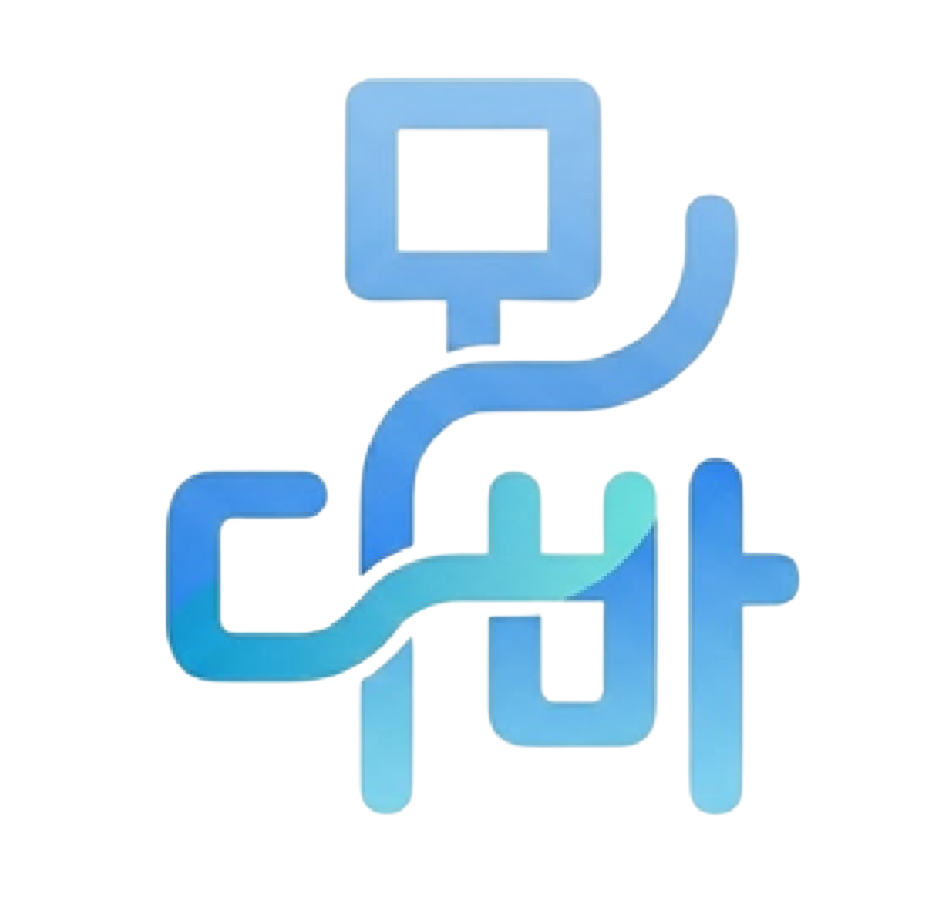
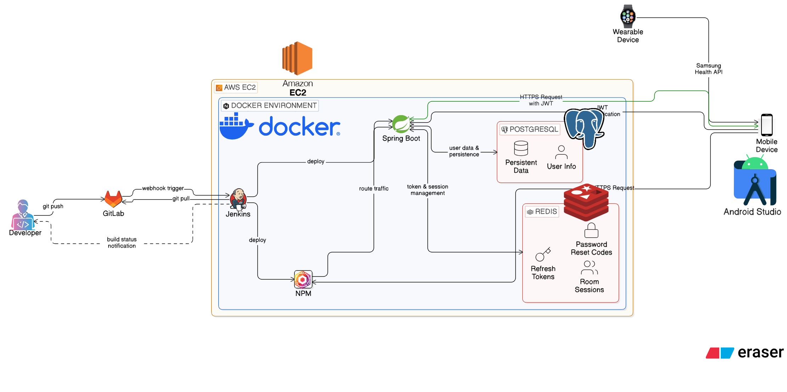
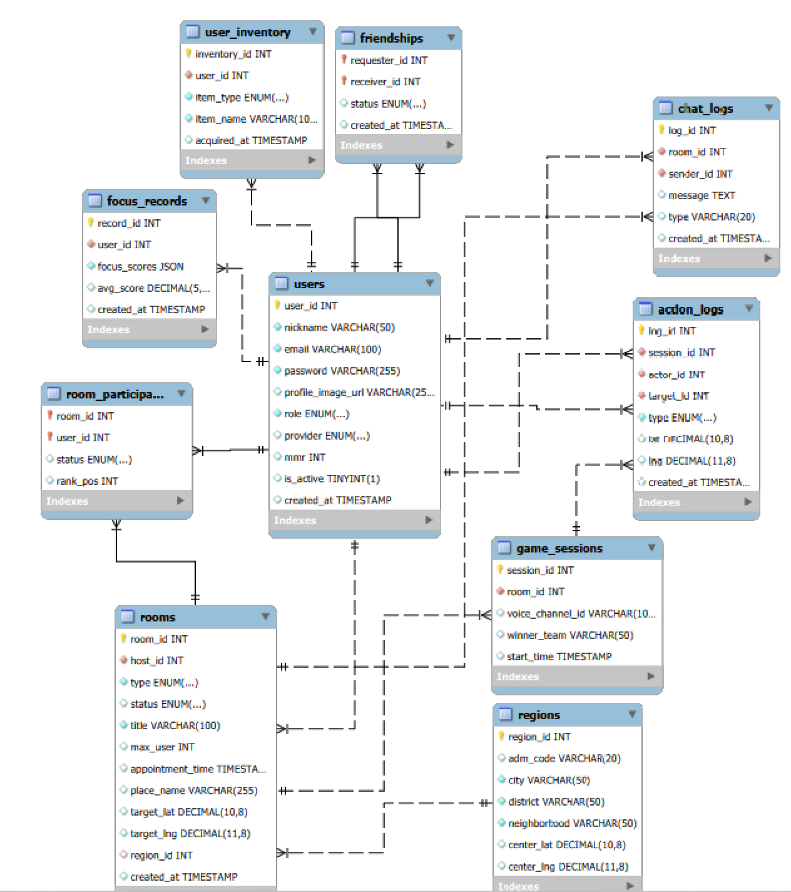
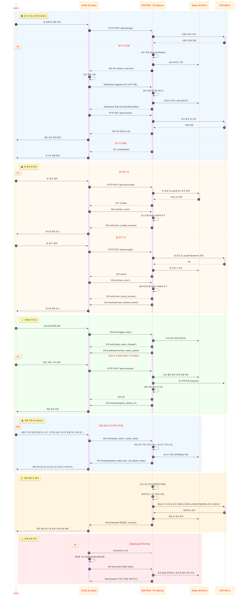

<div align="center">
  

  # 모다바 (MODABA)

  ### 모여서 다같이 바깥으로!

  **SSAFY 12기 공통 프로젝트 | C204팀**

  <br/>

  
  
  
  
  
  
  
  
</div>

---

## 📖 프로젝트 소개

**모다바**는 친구들과 함께 밖으로 나가 즐길 수 있는 **위치 기반 모바일 게임 플랫폼**입니다.  
실시간 GPS 추적과 카카오맵을 활용하여 **경도**, **약속**, **집중** 세 가지 모드를 제공하며,  
MMR 기반 랭킹 시스템과 소셜 기능으로 경쟁과 협력의 재미를 더했습니다.

---

## 🎮 주요 기능

### 🚔 경도 (Kyungdo) — 실시간 경찰 vs 도둑

- 실제 지도 위에서 팀을 나눠 진행하는 위치 기반 경찰-도둑 게임
- PostGIS 공간 쿼리를 활용한 게임 구역(경계/감옥) 설정
- 실시간 위치 공유, 체포(ARREST) / 탈출(ESCAPE) / 태그(TAG) 액션 처리
- MMR 기반 매치메이킹 및 랭킹 시스템

### 📍 약속 (Appointment) — 만남의 경쟁

- 목표 지점과 약속 시간을 설정하고 참여자들이 먼저 도착하는 경쟁
- 이동 궤적, 총 이동 거리, 평균/최고 속도 등 활동 데이터 기록
- 실시간 도착 순위 확인

### 📚 집중 (Focus) — 함께하는 집중 세션

- 그룹 집중력 점수 측정 및 평균 점수 산출
- AI 기반 집중도 분석 리포트 자동 생성 및 한 줄 요약 제공
- 세션별 학습 기록 관리

### 👥 소셜 기능

- 카카오 / 네이버 소셜 로그인 (Local 계정 지원)
- 친구 요청 / 수락 / 거절 시스템
- 캐릭터 & 배지 인벤토리 아이템
- 음성 채널 연동 지원

---

## 🏗️ 시스템 아키텍처



---

## 🗄️ ERD



---

## 🔄 시퀀스 다이어그램



---

## 🛠️ 기술 스택

| 구분 | 기술 |
|------|------|
| **Android Client** | Kotlin, Jetpack Compose, Material3, Navigation Compose |
| | Retrofit2, OkHttp, Kakao Maps SDK, Google Play Services Location |
| **Backend** | Java 21, Spring Boot 4.0.1, Gradle 8.5 |
| **Database** | PostgreSQL 17 + PostGIS 3.5 (공간 데이터), Redis 7 |
| **인증** | JWT, Kakao OAuth2, Naver OAuth2 |
| **인프라** | Docker, Docker Compose, Linux Ubuntu (Host Network Mode) |
| **CI/CD** | Jenkins 파이프라인 + Mattermost 빌드 알림 |
| **네트워크** | Nginx Proxy Manager (리버스 프록시), Cloudflare (DNS / SSL·TLS) |

---

## 📁 프로젝트 구조

```
modaba/
├── ERD.png                         # ERD 다이어그램
├── architecture.png                # 시스템 아키텍처 도식
├── sequence-diagram2.png           # 시퀀스 다이어그램
├── app_logo.png                    # 앱 로고
└── modaba_source_code/
    ├── Dockerfile                  # 백엔드 Docker 이미지 (Java 21 멀티스테이지)
    ├── docker-compose.yml          # 프로덕션 Docker Compose
    ├── docker-compose-local.yml    # 로컬 개발용 Docker Compose
    ├── schema.sql                  # DB 스키마 초기화
    ├── data.sql                    # 초기 데이터 삽입
    ├── init_regions.py             # 행정구역 데이터 초기화 스크립트
    ├── client/
    │   └── android/                # Android 클라이언트 (Kotlin + Jetpack Compose)
    │       └── app/src/            # 앱 소스 코드
    └── server/                     # Spring Boot 백엔드
        └── src/                    # 서버 소스 코드
```

---

## 🚀 시작하기

### 사전 준비

- Docker & Docker Compose 설치
- Python 3 (지역 데이터 초기화 시)
- Android Studio (클라이언트 빌드 시)
- Kakao / Naver 개발자 앱 키 발급
- Linux Ubuntu 서버 환경 (host 네트워크 모드 사용)

### 1. 빌드 환경

| 구분 | 상세 |
|------|------|
| **OS (Server)** | Linux Ubuntu (Host Network Mode) |
| **OS (Mobile)** | Android 11 이상 |
| **Build SDK** | Gradle 8.5 / JDK 21 (Alpine 기반) |
| **Runtime JRE** | Eclipse Temurin 21 (JRE Alpine 기반) |
| **Framework** | Spring Boot 4.0.1, Android Studio |
| **Database** | PostGIS 17 (Docker), Redis 7 (Docker) |

> ⚠️ **포트 주의사항**: `network_mode: host` 설정으로 동작하므로, 호스트 OS의  
> **5432**(PostgreSQL), **6379**(Redis), **8080**(Backend) 포트 점유 여부를 반드시 확인하세요.

### 2. 환경 변수 설정

`modaba_source_code/` 디렉토리에 `.env` 파일을 생성합니다. (실제 시크릿값은 `exec/.env` 파일 참조)

```env
# Server Config
SERVER_PORT=8080
TIMEZONE=Asia/Seoul

# Security
JWT_SECRET=your_jwt_secret

# PostgreSQL
POSTGRES_DB=your_db_name
POSTGRES_USER=your_db_user
POSTGRES_PASSWORD=your_db_password

# Kakao OAuth
KAKAO_REST_API_KEY=your_kakao_rest_api_key
KAKAO_CLIENT_SECRET=your_kakao_client_secret
KAKAO_REDIRECT_URL=your_kakao_redirect_url

# Naver OAuth
NAVER_CLIENT_ID=your_naver_client_id
NAVER_CLIENT_SECRET=your_naver_client_secret
NAVER_REDIRECT_URL=your_naver_redirect_url

# Google
GOOGLE_APPLICATION_PASSWORD=your_google_app_password
```

### 3. 백엔드 빌드 및 배포

```bash
cd modaba_source_code
docker-compose up -d --build
```

**Docker 멀티스테이지 빌드 프로세스**

1. **Build Stage**: `gradle:8.5-jdk21-alpine` 환경에서 `clean bootJar` 수행
2. **Runtime Stage**: `eclipse-temurin:21-jre-alpine` 환경으로 빌드된 `app.jar`만 복사하여 경량화된 컨테이너 실행

> 로컈 개발 환경에서는 `docker-compose -f docker-compose-local.yml up -d --build` 사용

### 4. DB 초기화

Docker 컨테이너 **최초 실행 시** 아래 스크립트가 순차적으로 실행되어 DB 스키마와 기초 데이터를 구성합니다.

```
schema.sql  →  /docker-entrypoint-initdb.d/01-initSchema.sql
data.sql    →  /docker-entrypoint-initdb.d/02-initData.sql
```

행정구역 데이터는 별도 스크립트로 초기화합니다:

```bash
cd modaba_source_code
python3 init_regions.py
```

### 5. Android 클라이언트 빌드

1. Android Studio에서 `modaba_source_code/client/android` 경로를 프로젝트로 열기
2. `local.properties`에 서버 주소 및 Kakao Maps Native App Key 추가
3. 디바이스 또는 에뮬레이터에서 실행 (**minSdk 26 / Android 8.0** 이상)

---

## 🔗 외부 서비스 연동

| 서비스 | 설명 |
|--------|------|
| **Kakao OAuth 2.0** | 카카오 로그인 (Callback URL 설정 필요) |
| **Naver OAuth 2.0** | 네이버 로그인 (Callback URL 설정 필요) |
| **Jenkins** | CI/CD 파이프라인 자동화 |
| **Mattermost** | Jenkins 빌드 성공/실패 알림 |
| **Cloudflare** | DNS 관리 및 SSL/TLS 암호화 |
| **Nginx Proxy Manager** | 리버스 프록시 및 호스트 포트 라우팅 |

---

## 🗃️ 데이터베이스 구성

| 테이블 | 설명 |
|--------|------|
| `users` | 사용자 계정 (소셜 로그인, MMR, 역할) |
| `rooms` | 게임 방 (경도/약속/집중 타입, 공간 경계 Geometry) |
| `room_participants` | 방 참가자 (역할, 상태, 위치 공유 여부) |
| `game_sessions` | 게임 세션 (승리 팀, 시작/종료 시간) |
| `action_logs` | 경도 게임 액션 기록 (체포/탈출/태그) |
| `user_game_activities` | 이동 궤적, 거리, 속도, AI 리포트 |
| `focus_records` | 집중 점수 기록 |
| `friendships` | 친구 관계 (PENDING / ACCEPTED / REJECTED) |
| `mmr_history` | MMR 변동 이력 |
| `user_inventory` | 캐릭터 & 배지 보유 목록 |
| `chat_logs` | 방 내 채팅 메시지 |
| `regions` | 행정구역 마스터 데이터 |

---

<div align="center">
  <sub>⚡ SSAFY 12기 공통 프로젝트 | 삼성 청년 SW 아카데미</sub>
</div>
